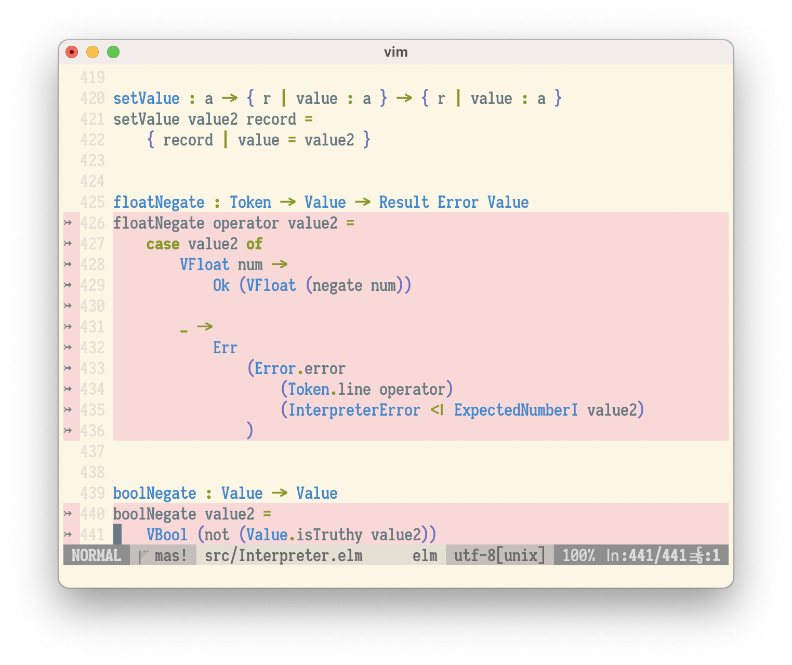

coverage-highlight.vim
----------------------

Vim plugin to highlight source code lines that lack test coverage.

Supports `elm-coverage`.

Commands
--------

:HighlightCoverage
    Highlight untested source lines for all files mentioned in the coverage
    report.

    Skips files not currently loaded into buffers, due to a limitation of Vim.

:HighlightCoverageRedo
    Run the coverage script, even if the report already exists.

:HighlightCoverageOff
    Turns off coverage highlighting

:ToggleCoverage
    Toggles coverage highlighting on and off

:NextUncovered
    Jump to the next uncovered range of source lines

:PrevUncovered
    Jump to the previous uncovered range of source lines

Settings
--------

g:coverage_script
    Default: "" (which means autodetect)

    Name of the script that can produce reports. Example::

        let g:coverage_script = 'elm-coverage -s'

    By default it looks for ``coverage`` in your PATH, and if not found,
    it looks for ``bin/coverage`` relative to the current working
    directory.

g:coverage_sign
    Default: "↣" (">>" on non-UTF-8 setups)

g:coverage_sign_branch
    Default: "↦" ("~>" on non-UTF-8 setups)

g:coverage_sign_branch_target
    Default: "⇥" (">~" on non-UTF-8 setups)

    Signs used in sign_column (empty string allowed). Example::

        let g:coverage_sign = '#'
        let g:coverage_sign_branch_target = ''

Highlight groups
----------------

If you want to change the highlighting, add this to your ``.vimrc``::

  highlight NoCoverage ctermbg=... guibg=...
  highlight NoBranchCoverage ctermbg=... guibg=...
  highlight NoBranchCoverageTarget ctermbg=... guibg=...

with the colors you want.  See vim's ``:help cterm-colors`` and
``:help gui-colors`` for the color values to use.

Mappings
--------

You may want to add this to your ``.vimrc``::

  noremap [C :<C-U>PrevUncovered<CR>
  noremap ]C :<C-U>NextUncovered<CR>

Requirements
------------

Vim 8.0.0251 or newer with Python or Python3 support.

Copyright
---------

``coverage-highlight.vim`` was written by Marius Gedminas <marius@gedmin.as>
and contributors.

Later forked and modified for `elm-coverage` by Martin Janiczek <martin@janiczek.cz>.

Licence: MIT.
